# **DigitalForensi and Incident Response (DFIR) Report**

# **Incident Overview**

Elpaco Ransomware, a variant of the Mimic Ransomware family, is a sophisticated threat that employs advanced techniques to disable system defenses and encrypt files. It uses the Everything library for fast file searching and includes a customizable GUI for attackers. Elpaco targets both local and network drives, leaving a ransom note and ensuring persistence by modifying system settings and blocking recovery options. The ransomware is distributed via phishing emails and exploits vulnerabilities like **CVE-2020-1472** (Zerologon) to gain initial access. Once inside, it elevates privileges and executes its payload, encrypting a wide range of file types while excluding essential system files to avoid detection. Elpaco also stops virtual machine operations, deletes backup data, and modifies system configurations to ensure ongoing execution. The ransomware's encryption specifically targets critical data files, making system restoration and data recovery significantly more difficult.

## **Initial Access**

The initial access to the compromised system was gained through a **brute-force attack** on the **MSSQL server**, leading to successful login after multiple failed attempts. The attacker used this access to deploy malicious software on the system.

#### **Findings:**

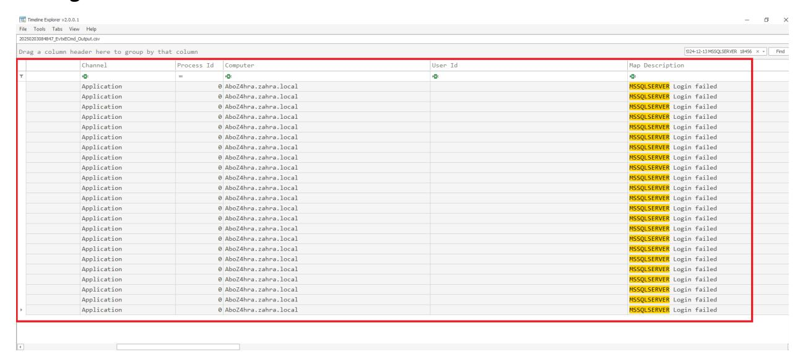

#### **Recommendation:**

- **Implement multi-factor authentication (MFA)** for all critical systems, including MSSQL, to prevent brute-force logins.
- **Monitor failed login attempts** to identify potential brute-force or password guessing attacks.
- **Enforce strong password policies**, including complexity requirements and regular updates, to mitigate the success of brute-force attacks.

# **Execution**

After gaining access, the malicious executable was deployed as a **dropper**, facilitating the installation of ransomware and other malicious components. This allowed the ransomware to encrypt files and further propagate across the system.

### **Findings:**

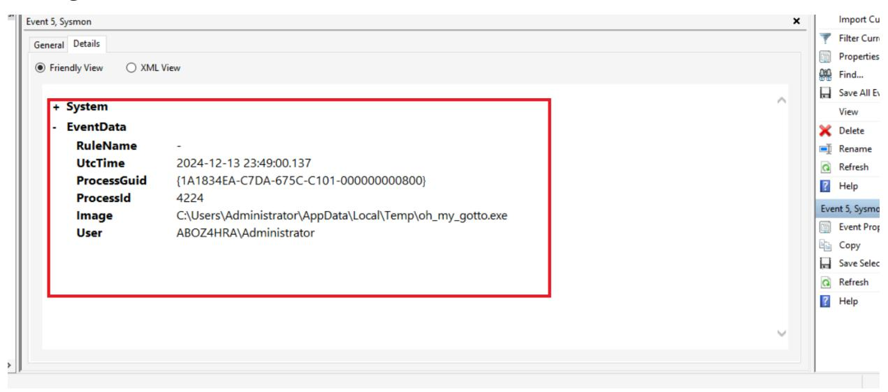

After executing the main malicious binary as a dropper, the initial malicious components were dropped into the **%AppData%\Local** directory, inside a separate directory with a randomly generated UUID as the name.

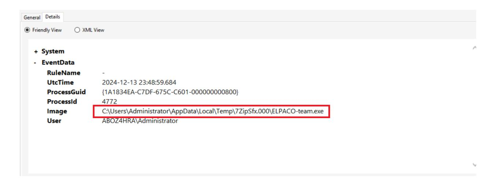

### **Recommendation:**

- **Implement endpoint protection solutions** to detect and block malicious executables.
- **Use application whitelisting** to prevent unauthorized applications from executing.
- **Conduct regular vulnerability assessments** to identify weak points that could be exploited by attackers to deploy malware.

### **Persistence**

The attacker ensured persistence by installing AnyDesk, configuring it to automatically reconnect upon system restarts, bypassing defensive measures. Additionally, the **net start** command was used to configure AnyDesk to automatically reconnect upon system restarts, maintaining access even after reboots or defense measures were taken.

#### **Key Points:**

- **Remote Access Software (AnyDesk):** Installed to allow remote access and maintain persistence.
- **Use of net start Command:** Configured to automatically reconnect AnyDesk after system restarts.
- **Exploitation of Windows Remote Access:** Leveraged built-in remote access functionality for persistent control.

#### **Findings:**

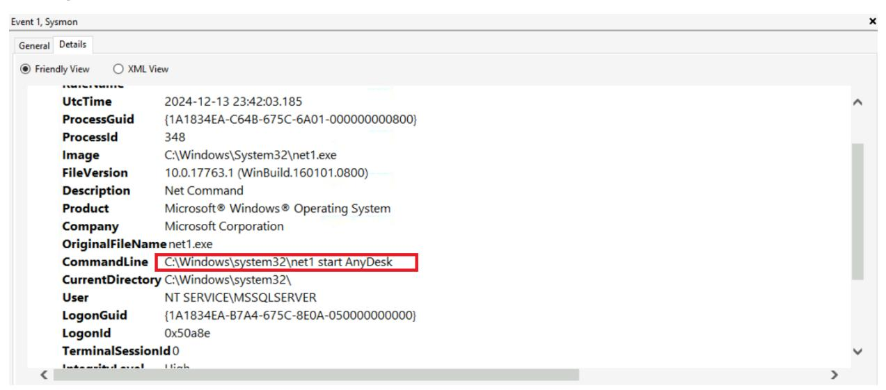

#### **Recommendation:**

- **Regularly audit installed software** to ensure only authorized tools (such as AnyDesk) are present on systems.
- **Monitor for unusual network connections** and remote access tools on endpoints.
- **Configure firewalls** and **network segmentation** to prevent unauthorized access and reduce the attack surface.
- **Use endpoint detection and response (EDR) solutions** to monitor and block suspicious network activity related to remote access tools.

# **Defense Evasion**

Employing PowerShell, the adversary excluded the entire **C:\** drive from Windows Defender scans using the command **Set-MpPreference -ExclusionPath 'C:\'**. This action effectively bypassed detection, allowing malicious activities to continue unnoticed by the security software.

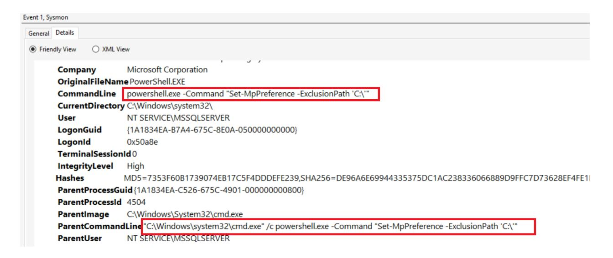

With the **password** successfully obtained, the protected **archive** containing the additional malicious payloads can now be accessed and analyzed. This access is crucial for understanding the full extent of the attack and mitigating further risks.

| ProcessGuid     | {1A1834EA-C7DE-675C-C401-000000000800}                                                                                  |
|-----------------|-------------------------------------------------------------------------------------------------------------------------|
| ProcessId       | 5216                                                                                                                    |
| lmage           | C:\Users\Administrator\AppData\Local\Temp\7ZipSfx.000\7za.exe                                                           |
| FileVersion     | 21.06                                                                                                                   |
| Description     | 7-Zip Standalone Console                                                                                                |
| Product         | 7-Zip                                                                                                                   |
| Company         | Igor Pavlov                                                                                                             |
| OriginalFileNan | <b>ne</b> 7za.exe                                                                                                       |
| CommandLine     | "C:\Users\Administrator\AppData\Local\Temp\7ZipSfx.000\7za.exe" x -y -p <mark>7</mark> 183204373585782 Everything64.dll |
| CurrentDirector | ry C:\Users\ADMINI~1\AppData\Local\Temp\7ZipSfx.000\                                                                    |
| User            | ABOZ4HRA\Administrator                                                                                                  |
| LogonGuid       | {1A1834EA-B822-675C-06E4-0E0000000000}                                                                                  |
| Logonid         | 0xee406                                                                                                                 |
| TerminalSession | nld2                                                                                                                    |
| IntegrityLevel  | High                                                                                                                    |
|                 |                                                                                                                         |

**The malware creates a specific directory** to store and copy the dropped files. To identify this directory, we need **the first 8 characters** of its name. This detail is crucial for **tracking the malware's activities** and understanding its behavior on the infected system.

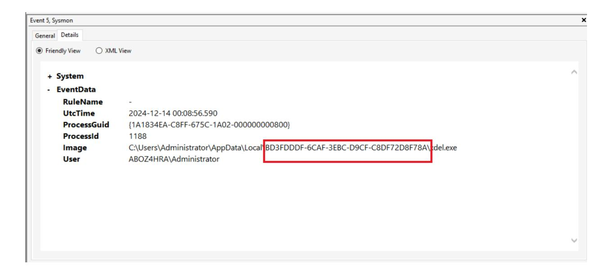

The ransomware was disguised by the attacker, **renaming it to mimic a legitimate system process**. To identify this masquerading technique, we need to know **the new name assigned to the ransomware**, which is crucial for understanding **the attacker's evasion strategy**.

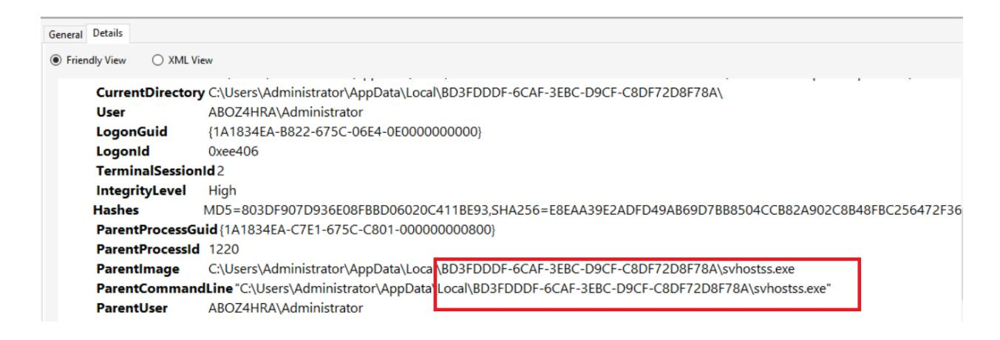

The system **recorded the execution** of a process **disabling Windows Defender**. The event log shows it ran with **system privileges**, providing detailed information about the **process**, **command line**, **hashes**, and **associated user account**. This indicates a significant security event requiring immediate attention to mitigate potential threats.

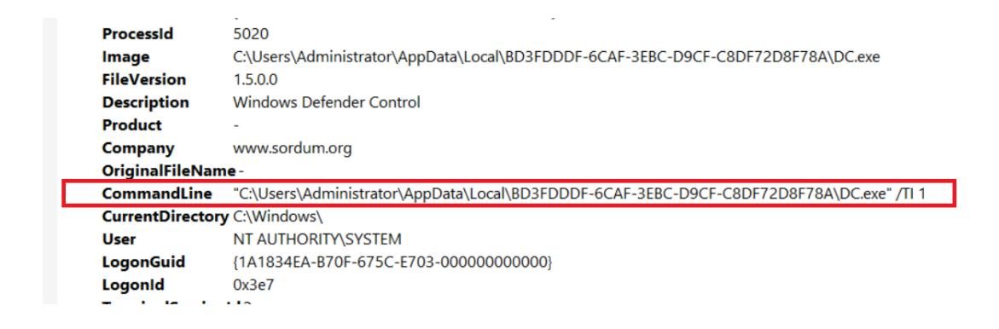

# **Command and Control (C2)**

The compromised system was configured to communicate with an external **command and control (C2) server**, facilitating the transfer of tools and data. The **IP address** and **port** used for this communication were identified during the investigation.

A **GUI process** was also used to control the ransomware's encryption remotely.

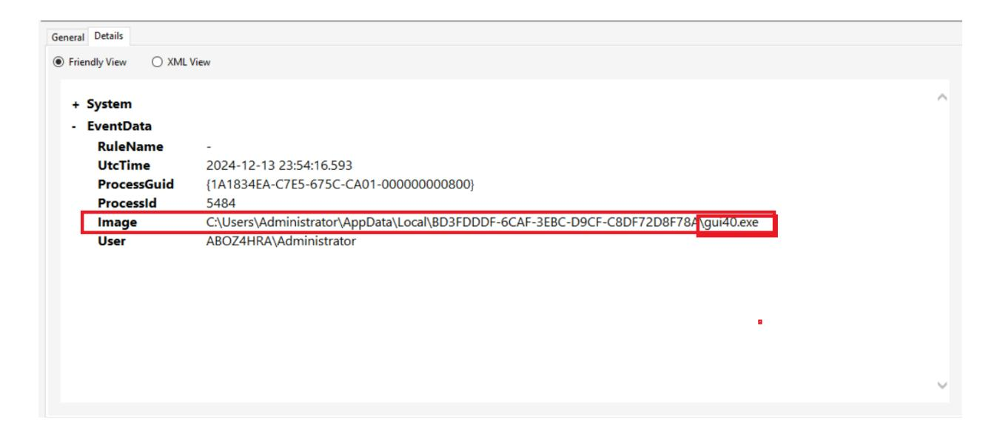

#### **Recommendation:**

- **Monitor network traffic** for unusual outbound connections to external servers, particularly C2 servers.
- **Block known malicious IPs and domains** associated with C2 communications using DNS filtering and firewalls.
- **Implement network traffic analysis** tools to detect anomalies and unauthorized communications.

● **Conduct regular penetration testing** to identify vulnerabilities in network configurations and communication channels.

## **Exfiltration**

After dumping the **credentials**, the attacker **transferred the output file** to their **C2 server**. The name of the **exfiltrated file** was identified during the investigation. This information is vital for understanding the attack's methods and enhancing security measures to prevent similar breaches in the future.

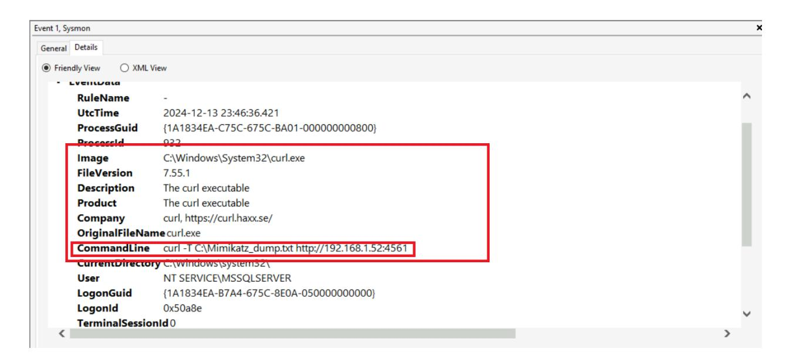

# **Impact**

After launching the **ransomware**, it used a **legitimate DLL component** to select **target files for encryption**. The name of the **DLL** was identified during the investigation. This information was crucial in understanding the ransomware's behavior and improving security measures to prevent similar attacks.

### **Findings:**

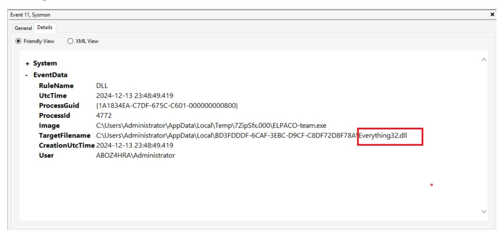

The ransomware employs a **comprehensive configuration setup** and uses a **randomly generated specified decryption ID**. The **decryption key** was identified during the investigation. The ransom note warns the victim not to scan the files with antivirus software to prevent data loss and states that their data is encrypted. The note claims that due to an **IT security weakness**, the victim's files were encrypted, and the only method of recovering them is by purchasing a decryption tool and key. This information is crucial for understanding the ransomware's encryption mechanism and enhancing security measures to prevent similar attacks in the future.

The attacker used a **tool to cover their tracks** and **prevent forensic analysis** by **overwriting data** to prevent recovery. The official name of the **tool** used by the attacker was identified during the investigation. The attacker **renamed the tool** to avoid detection. This information is crucial for understanding the attacker's methods and enhancing security measures to prevent similar breaches in the future.

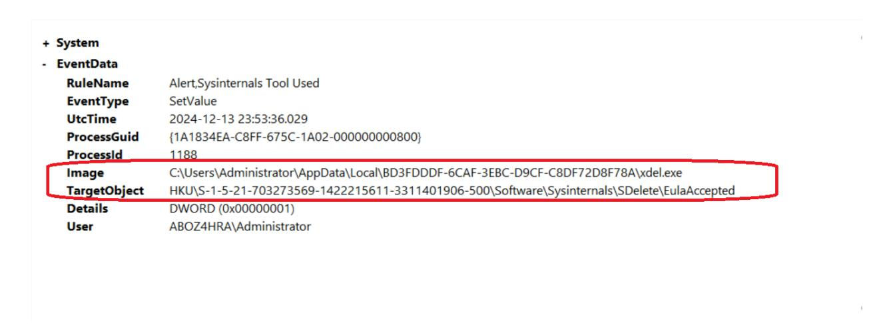

#### **Recommendation:**

- **Regularly backup critical data** to reduce the impact of ransomware attacks and prevent data loss.
- **Use data encryption** to protect sensitive information and make it more difficult for attackers to access valuable data.
- **Implement strong authentication mechanisms** to protect accounts from credential dumping attacks.
- **Monitor for unusual file access patterns** to detect data exfiltration or ransomware encryption activities early.

### **Conclusions and Recommendations**

This ransomware attack was initiated through a brute-force attack on a **MSSQL server**, followed by the deployment of a ransomware dropper. The attacker maintained persistence using **AnyDesk** and evaded detection through advanced defense evasion techniques. The attack ultimately resulted in the encryption of files and credential exfiltration.

#### **Key Recommendations:**

- **Improve MSSQL security** by implementing multi-factor authentication (MFA) and enforcing strong password policies.
- **Monitor network traffic** for signs of remote access tools and other suspicious activities.
- **Strengthen endpoint security** by deploying antivirus/EDR solutions, application whitelisting, and host-based intrusion detection systems (HIDS).
- **Regularly back up critical data** and encrypt sensitive files to prevent irreversible damage from ransomware attacks.

This report highlights the full forensic investigation of a ransomware attack, offering practical recommendations at each stage to strengthen defenses and minimize the risk of future attacks. By implementing these suggestions, organizations can better prepare for and mitigate the impact of cyber threats.